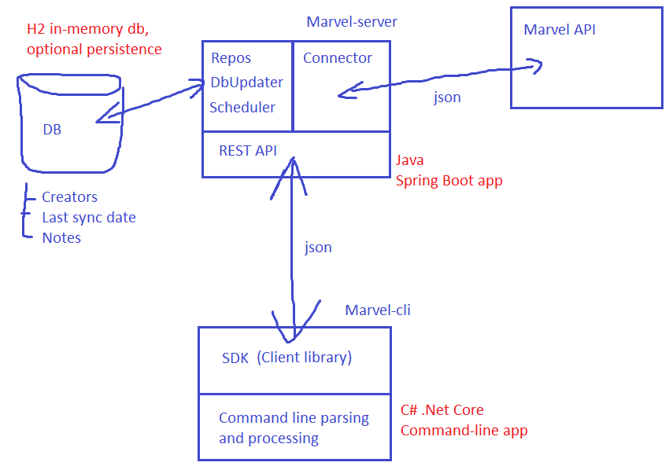

# Marvel Server - REST API Service

Wraps the Marvel API to provide custom filtering, sorting, note management and simple analysis.

## Design

Marvel server uses the Marvel Comics API to retrieve the data.

### Approach

My initial idea was to connect to Marvel Comics API ad-hoc to retrieve the necessary data.
This approach did not work due to several limitations of Marvel Comics API, notably:
* There is no way to order results by number of comics/series (asked Marvel support for a help, no reply)
* Terrible response times: the response time for many calls was way over a minute

So I decided to use the Marvel Comics API to retrieve the original data, build my own projection using only properties I needed and store it locally for quierying.

So in essence, my approach is:
* Request creators from Marvel Comics API, ordered my modified
* Go through every page of the result set and store every creator data in the local db
* Keep track of creator modified date, once we done with a certain date, store this value in the local db to avoid retrieving the same data again
* Schedule db re-sync on regular intervals (every 24 hours) to pick up any changes in Marvel Comics API

Considering the quite small amount of data retrieved (slightly over 6000 creators), this approach have shown to be quite effective. There were 2 extra hacks required:
* The earliest record I could retrieve when providing modifiedSince filter was from 2007-01-01. All records before that were excluded from the results. So I had to do my initial request without modifiedSince filter
* When no modifiedSince filter is specified, Marvel Comics API retrieve first creators with modified from 1969-12-31, then with -0001-11-30, then all the rest. This order does not make much sense to me, and since these dates were not visible using modifiedSince filter anyway, I normalized all the dates before 2007-01-01 as being of 1970-01-01

### Main components

The marvel-server project is built out of 3 main parts:
* __Marvel Connector (package net.artemkv.marvelconnector):__ Knows how to speak to Marvel Comics API. Exposes all the data through the MarvelApiRepository, which serves as a facade for the connector, hiding all the implementation details. It returns interfaces to avoid any dependency on JSON objects and converts low-level exceptions into exceptions that match the absraction level of the connector.
* __Marvel Server - REST Api (package net.artemkv.marvelserver.rest):__ Contains controllers, JSON models and business logic for request handling.
* __Marvel Server (package net.artemkv.marvelserver):__ Provides run-time for the service. This is a standard Spring Boot application. Contains logic to update the local db from Marvel Comics API on scheduled intervals.

I used H2 in-memory database configured to persist data on disk to speed up the development. In real life this should be replaced by more robust solution.



## Build and run the project

This is a standard Maven project, so you can build it (and run unit-tests) using:

```
mvnw clean package
```

Note: this will also create a Docker container. If you don't have Docker installed, you can build it just until the package step (compile + unit tests), by running: 

```
mvnw clean test
```

And to run it:

```
mvnw spring-boot:run
```

## Dependencies

### External:

* Docker (Build-time, for packaging and delivery)

### Maven-managed:

* Spring Boot Web Starter
* Spring Boot Data JPA Starter
* Spring Boot Actuator Starter
* H2 Database Engine (Java SQL database)
* Retrofit (type-safe HTTP client for Android and Java)
* Retrofit Converter: Gson (Gson converter for Retrofit)

### Maven plugins

* Spring Boot Maven Plugin (provides Spring Boot support in Maven)
* Maven Surefire Plugin (runs the unit tests of an application)
* dockerfile-maven-plugin (a Maven plugin for building and pushing Docker images)


## Configuration properties

application.properties
```
server.address - the address on which the service will be available (0.0.0.0)
server.port - the port on which the service will be available (8080)
spring.datasource.url - the connection string to connect to H2 database (jdbc:h2:file:~/marveldb;DB_CLOSE_ON_EXIT=FALSE;AUTO_RECONNECT=TRUE)
management.endpoints.web.exposure.include - changes which actuator endpoints (/health, /logfile etc.) are exposed (*)
management.endpoint.health.show-details - configures the information exposed by the health endpoint (always)
logging.path - the path to the log file (logs)
```

marvelapi.properties
```
marvelapi.url - the base url to connect to Marvel Comics API (http://gateway.marvel.com/)
marvelapi.page_size - the page size when retrieving the data from Marvel Comics API (100)
marvelapi.public_key - the public key required to connect to Marvel Comics API
marvelapi.private_key - the private key required to connect to Marvel Comics API
marvelapi.connection_timeout - the connection timeout when connecting to Marvel Comics API (60)
marvelapi.read_timeout - the read timeout when connecting to Marvel Comics API (60)
```

marvelservice.properties
```
marvelservice.retries - the number of retries for a single call when trying to retrieve data from Marvel Comics API (3)
```

## Environment variables:

Note: Values of environment variables override the configuration parameters.

```
SERVER_ADDRESS - the address on which the service will be available (0.0.0.0)
SERVER_PORT - the port on which the service will be available (8080)
DB_CONNECTION_STRING - the connection string to connect to H2 database (jdbc:h2:file:~/marveldb;DB_CLOSE_ON_EXIT=FALSE;AUTO_RECONNECT=TRUE)
MANAGEMENT_ENDPOINTS - changes which actuator endpoints (/health, /logfile etc.) are exposed (*)
HEALTH_DETAILS - configures the information exposed by the health endpoint (always)
LOGGING_PATH - the path to the log file (logs)

MARVEL_API_URL - the base url to connect to Marvel Comics API (http://gateway.marvel.com/)
MARVEL_API_PAGE_SIZE - the page size when retrieving the data from Marvel Comics API (100)
MARVEL_API_PUBLIC_KEY - the public key required to connect to Marvel Comics API
MARVEL_API_PRIVATE_KEY - the private key required to connect to Marvel Comics API
MARVEL_API_CONNECTION_TIMEOUT - the connection timeout when connecting to Marvel Comics API (60)
MARVEL_API_READ_TIMEOUT - the read timeout when connecting to Marvel Comics API (60)
```

## REST API Endpoints

### GET /api/creators

Returns the list of creators, paginated.

#### Options:

* __fullName__ - retrieve the creators that have full name containing provided value.
* __modifiedSince__ - retrieve the creators that are modified since the date specified. Format: "2007-01-01T00:00:00", url encoded.
* __page__ - The page number.
* __size__ - The page size.
* __sort__ - The sorting order. Fields allowed: "id", "fullName", "modified", "comicsTotal", "seriesTotal". Use "modified,desc" to sort in descending order. Multiple sort params are allowed to sort on several properties.

#### Examples:

```
http://localhost:8080/api/creators

http://localhost:8080/api/creators?sort=modified&page=2&size=5

http://localhost:8080/api/creators?sort=modified&sort=id,desc&page=0&size=5

http://localhost:8080/api/creators?sort=comicsTotal,desc&page=2&size=5

http://localhost:8080/api/creators?sort=modified&page=2&size=5&modifiedSince=2007-01-01T00%3A00%3A00

http://localhost:8080/api/creators?sort=modified&page=0&size=5&fullName=rick

http://localhost:8080/api/creators?sort=modified&page=0&size=5&modifiedSince=2007-01-01T00%3A00%3A00&fullName=rick
```

#### Result:

```
{
  "pageNumber": 3,
  "pageSize": 5,
  "total": 6199,
  "count": 5,
  "results": [
    {
      "id": 12507,
      "fullName": "Christopher Moeller",
      "modified": "1970-01-01T01:00:00",
      "comicsTotal": 3,
      "seriesTotal": 2,
      "note": null
    },
    {
      "id": 12631,
      "fullName": "Bill Hughes",
      "modified": "1970-01-01T01:00:00",
      "comicsTotal": 9,
      "seriesTotal": 3,
      "note": {
        "id": 34,
        "text": "Hello note",
        "creatorId": 12631,
        "creatorFullName": "Bill Hughes"
      }
    },
    ...
  ]
}
```

### GET /api/creator/{creatorId}

Returns the creator by id.

#### Examples:

```
http://localhost:8080/api/creator/12976
```

#### Result:

```
{
  "id": 12976,
  "fullName": "Patrick Brown",
  "modified": "2017-02-10T12:17:34",
  "comicsTotal": 11,
  "seriesTotal": 3,
  "note": {
    "id": 34,
    "text": "Hello note modified",
    "creatorId": 12976,
    "creatorFullName": "Patrick Brown"
  }
}
```

### PUT /api/creator/{creatorId}/note

Updates the note for the creator with given id.
When note does not exist, creates the new one. When note exists, overwrites it.

#### Examples:

```
Url:
http://localhost:8080/api/creator/12976/note

Body:
{
  "text": "Cool creator"
}
```

### DELETE /api/creator/{creatorId}/note

Deletes the note for the creator with given id.

#### Examples:

```
Url:
http://localhost:8080/api/creator/12976/note
```

### GET /api/notes

Returns the list of notes, paginated.

#### Options:

* __text__ - retrieve the notes which text contains the provided string.
* __page__ - The page number.
* __size__ - The page size.
* __sort__ - The sorting order. Fields allowed: "id", "text". Use "id,desc" to sort in descending order. Multiple sort params are allowed to sort on several properties.

#### Examples:

```
http://localhost:8080/api/notes?text=cre&sort=id,desc
```

#### Result:

```
{
  "pageNumber": 0,
  "pageSize": 20,
  "total": 2,
  "count": 2,
  "results": [
    {
      "id": 35,
      "text": "This creator is very cool!",
      "creatorId": 25,
      "creatorFullName": "Alex Maleev"
    },
    {
      "id": 1,
      "text": "Cool creator",
      "creatorId": 12980,
      "creatorFullName": "Vc Cory Petit"
    }
  ]
}
```

### GET /api/note/{noteId}

Returns the note by id.

#### Examples:

```
http://localhost:8080/api/note/1
```

#### Result:

```
{
  "id": 1,
  "text": "Cool creator",
  "creatorId": 12980,
  "creatorFullName": "Vc Cory Petit"
}
```

### GET /actuator/health

Health endpoint.
Use management.endpoints.web.exposure.include property (or MANAGEMENT_ENDPOINTS environment variable) to disable it.
Use management.endpoint.health.show-details property (or HEALTH_DETAILS environment variable) to control what is visible.

#### Examples:

```
http://localhost:8080/actuator/health
```

#### Result:

```
{
  "status": "UP",
  "details": {
    "upToDateHealthCheck": {
      "status": "UP"
    },
    "db": {
      "status": "UP",
      "details": {
        "database": "H2",
        "hello": 1
      }
    },
    "diskSpace": {
      "status": "UP",
      "details": {
        "total": 253889605632,
        "free": 194039353344,
        "threshold": 10485760
      }
    }
  }
}
```

### GET /actuator/logfile

If enabled, shows the logfile.
Use management.endpoints.web.exposure.include (or MANAGEMENT_ENDPOINTS environment variable) property to disable it.

#### Examples:

```
http://localhost:8080/actuator/logfile
```

#### Result:

```
2019-02-25 09:59:39.417 DEBUG 2504 --- [scheduling-1] net.artemkv.marvelserver.LocalDbUpdater  : Updating creators from Marvel...
2019-02-25 09:59:39.418 DEBUG 2504 --- [scheduling-1] n.a.marvelserver.MarvelServiceImpl       : Requesting creators modified since 2019-02-19 14:40:26.0, at offset 0
2019-02-25 09:59:40.095 DEBUG 2504 --- [scheduling-1] net.artemkv.marvelserver.LocalDbUpdater  : Done updating creators from Marvel
```